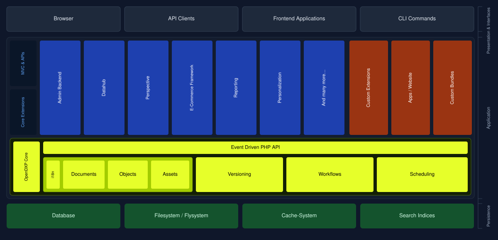

# Architecture Overview

A high-level overview of how OpenDXP is structured.

## Reading the Chart

| Color        | Meaning                                              |
|--------------|------------------------------------------------------|
| Dark blue    | Shipped with OpenDXP — Core extensions and MVC layer |
| Dark orange  | Your project — custom extensions, apps, and bundles  |
| Yellow-green | OpenDXP Core — the heart of the platform             |
| Dark green   | Persistence layer — managed by OpenDXP Core          |

## Layers

### Presentation & Interfaces
OpenDXP can be accessed through a browser, any HTTP/REST API client, headless frontend applications, or CLI commands. 
The MVC layer handles all HTTP interactions; the Core can also be bootstrapped directly without HTTP for CLI use cases.

### Application
The application layer is split into two areas:

**MVC & APIs / Core Extensions** — Bundles shipped with OpenDXP that extend the Core with ready-to-use functionality. 
These include the Admin Backend, Datahub, E-Commerce Framework, Reporting, Personalization, and more. All are installable via Composer.

**Custom Extensions / Apps / Bundles** — Your project-specific code. 
This can be a website or headless app built on top of the MVC component, a reusable Symfony bundle, or a standalone custom extension using the OpenDXP PHP API directly.

### OpenDXP Core
The Core is the foundation of the platform. It provides:

- **Event Driven PHP API** — all Core functionality is accessible and extensible through a clean PHP API backed by Symfony's event system
- **Documents, Objects, Assets** — the three primary content and data types, each with full i18n support
- **Versioning, Workflows, Scheduling** — built-in content lifecycle management

### Persistence
OpenDXP Core manages access to the persistence layer.
The supported backends are a relational database (via Doctrine DBAL), the filesystem (via Flysystem), a cache system, and search indices.

## Where to Place Your Code
When building a solution on OpenDXP, your custom code belongs in one of two places:

- **Apps / Website** — solution-specific controllers, views, and models for your frontend or headless application
- **Custom Bundles** — reusable Symfony bundles for logic you want to share across projects